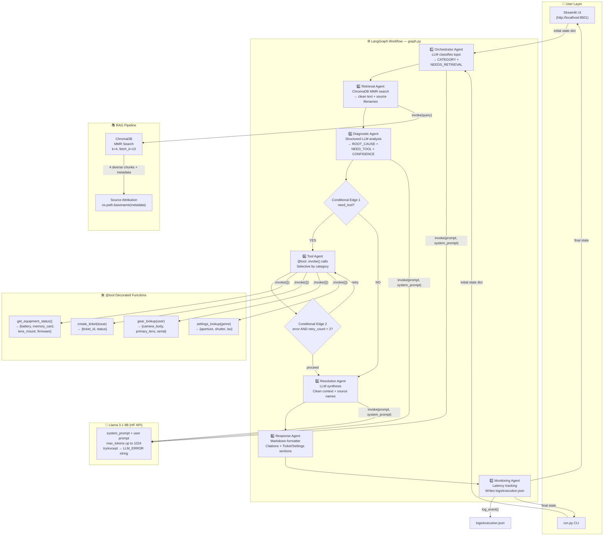
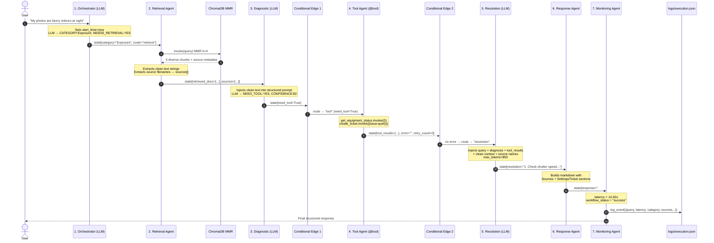

# 🏗️ Architecture & Workflow Walkthrough

## Project Structure

```
agentic-ai-photography-copilot/
│
├── .env                          ← HF_TOKEN, LangChain config
├── run.py                        ← CLI entry point
├── requirements.txt
├── run.txt                       ← Setup steps reference
│
├── knowledge_base/               ← 10 photography markdown docs (RAG source)
├── chroma_db/                    ← Vector DB (auto-built by ingest)
├── logs/
│   └── execution.json            ← Written by monitoring agent on every run
│
└── app/
    ├── __init__.py
    ├── llm.py                    ← HF Llama 3.1 wrapper, system prompt + max_tokens
    │
    ├── agents/
    │   ├── orchestrator.py       ← LLM topic classification
    │   ├── retrieval_agent.py    ← Clean text + source attribution
    │   ├── diagnostic_agent.py   ← Structured prompt + robust parsing
    │   ├── tool_agent.py         ← @tool .invoke() + selective + retry
    │   ├── resolution_agent.py   ← Clean context + source names
    │   ├── response_agent.py     ← Citations + ticket/settings sections
    │   └── monitoring_agent.py   ← Latency + logging
    │
    ├── rag/
    │   ├── loader.py, chunker.py, embeddings.py
    │   ├── vectordb.py, retriever.py (MMR search)
    │   └── ingest.py
    │
    ├── tools/
    │   ├── equipment_status_tool.py
    │   ├── ticket_tool.py
    │   ├── gear_tool.py
    │   └── settings_tool.py
    │
    ├── workflows/
    │   ├── state.py               ← AgentState schema
    │   └── graph.py                ← LangGraph wiring + conditional edges + retry loop
    │
    ├── monitoring/
    │   ├── logger.py, metrics.py, evaluator.py
    │
    └── ui/
        └── streamlit_app.py
```

---

## Architecture Diagram



---

## The Shared State Object

Every agent reads from and writes to a single `AgentState` dictionary as it flows
through the graph:

```python
class AgentState(TypedDict):
    query: str               # "My photos are blurry indoors at night"
    rewritten_query: str     # set to original query (rewrite skipped)
    retrieved_docs: List      # list of plain strings (not Document objects)
    sources: List[str]       # ["exposure_triangle.md", "troubleshooting_common_issues.md"]
    diagnosis: str            # structured LLM output
    category: str             # "Exposure", "Lens", "GenreSettings", etc.
    tool_results: Dict        # tool execution results
    resolution: str           # step-by-step recommendation text
    response: str             # final formatted markdown
    execution_path: List[str] # ["orchestrator", "retrieval", ...]
    monitoring: Dict          # timestamp, latency, status, etc.
    need_tool: bool           # drives conditional edge 1
    route: str                # "retrieve" or "direct"
    retry_count: int          # drives conditional edge 2 (retry logic)
    error: str                # error message from tool agent
    start_time: float         # set at orchestrator start → used for latency
```

---

## Step-by-Step Walkthrough

### Step 1 — User Submits Query

Both `run.py` (CLI) and `app/ui/streamlit_app.py` (Streamlit) build the same
initial state dictionary, with every field pre-populated to a safe default, and
call `graph.invoke(state)`.

### Step 2 — Orchestrator Agent (LLM Topic Classification)

**File:** `app/agents/orchestrator.py`

The orchestrator sends the query to Llama 3.1 with a system prompt that requires
it to classify into one of: `Exposure, Lens, Lighting, Composition, Maintenance,
Storage, PostProcessing, GenreSettings, Accessories, General`, plus whether
knowledge-base retrieval is needed.

```
CATEGORY: Exposure
NEEDS_RETRIEVAL: YES
```

The agent also records `start_time` for end-to-end latency tracking.

### Step 3 — Retrieval Agent (ChromaDB MMR Search)

**File:** `app/agents/retrieval_agent.py` / `app/rag/retriever.py`

The retriever uses **Maximal Marginal Relevance (MMR)** search — it fetches 10
candidate chunks and selects the 4 most relevant *and* diverse, avoiding
returning 4 near-identical chunks from the same paragraph.

The agent extracts `page_content` as plain strings (so downstream prompts get
clean text, not `Document(...)` object reprs) and records deduplicated source
filenames (e.g. `exposure_triangle.md`) for citation.

### Step 4 — Diagnostic Agent (Structured Analysis)

**File:** `app/agents/diagnostic_agent.py`

The diagnostic agent is given the query, detected category, and retrieved
context, and must respond in a strict format:

```
CATEGORY: Exposure
ROOT_CAUSE: Shutter speed too slow for handheld low-light shooting, causing motion blur
NEED_TOOL: YES
CONFIDENCE: 82
ANALYSIS: The symptoms described (blurry indoor/night shots) match classic camera-shake
patterns. Raising ISO and widening aperture would allow a faster shutter speed.
```

`NEED_TOOL` is parsed with multiple pattern checks for robustness against minor
LLM formatting variation.

### Step 5 — Conditional Edge 1 — Does This Need Tools?

**File:** `app/workflows/graph.py`

```python
def route_after_diagnostic(state):
    return "tool" if state["need_tool"] else "resolution"
```

### Step 6 — Tool Agent (Selective `@tool` Calls + Retry)

**File:** `app/agents/tool_agent.py`

* **Always** calls `get_equipment_status()` (battery, memory card, lens mount,
  firmware) and `create_ticket(issue)` for traceability.
* If the category is `GenreSettings`, `Composition`, or `Lighting`, it detects a
  known genre keyword (portrait, landscape, sports, wildlife, astro, macro, night,
  street) in the query and calls `settings_lookup(genre)` for a recommended
  aperture/shutter/ISO preset.
* If the category is `Lens` or `Accessories`, it calls `gear_lookup(user)` to
  retrieve the photographer's registered camera body and lens.
* Errors are caught, recorded in `state["error"]`, and `retry_count` is
  incremented.

### Step 7 — Conditional Edge 2 — Retry Logic

**File:** `app/workflows/graph.py`

```python
def route_after_tool(state):
    if state.get("error") and state.get("retry_count", 0) < 2:
        return "tool"       # retry
    return "resolution"     # proceed
```

A fault-tolerant retry pattern capped at 2 attempts to avoid infinite loops.

### Step 8 — Resolution Agent (Synthesis)

**File:** `app/agents/resolution_agent.py`

Combines the query, diagnosis, tool results, and clean retrieved context (with
named sources) into a single prompt, asking for numbered, actionable steps and
escalation guidance — `max_tokens=800`.

### Step 9 — Response Agent (Final Formatting)

**File:** `app/agents/response_agent.py`

Builds the final markdown response with:

* `## 🔍 Diagnosis` and `## ✅ Recommendation` sections
* `📄 Sources:` citation line (deduplicated knowledge-base filenames)
* `⚙️ Recommended Settings Preset` section (if a settings tool was used)
* `🎫 Support Ticket Created` section (always present, since a ticket is always
  created)
* A metadata line showing category, retries, and any error

### Step 10 — Monitoring Agent (Observability)

**File:** `app/agents/monitoring_agent.py` / `app/monitoring/logger.py`

Computes end-to-end latency, builds a monitoring dict, and appends it as a JSON
line to `logs/execution.json`:

```json
{
  "query": "My photos are blurry when I shoot indoors at night",
  "timestamp": 1780461861.86,
  "workflow_status": "success",
  "agents_executed": ["orchestrator", "retrieval", "diagnostic", "tool", "resolution", "response", "monitoring"],
  "latency_seconds": 14.92,
  "retry_count": 0,
  "category": "Exposure",
  "sources_used": ["exposure_triangle.md", "troubleshooting_common_issues.md", "lighting_techniques.md"],
  "need_tool": true,
  "error": ""
}
```

---

## Sequence Diagram



---

## Technology Summary

| Technology | Role |
|---|---|
| **LangGraph** | Stateful workflow with conditional routing + retry loop |
| **ChromaDB** | Local vector database |
| **BAAI/bge-small-en-v1.5** | Local embedding model |
| **Llama 3.1 8B** | LLM (orchestrator, diagnostic, resolution) |
| **HF InferenceClient** | API client, try/except → `LLM_ERROR` fallback |
| **LangChain `@tool`** | Tool registry — all 4 tools decorated, use `.invoke()` |
| **RAG Pipeline** | Knowledge retrieval + injection, MMR diversity search |
| **monitoring/logger.py** | JSON log writer — appends to `logs/execution.json` |
| **Streamlit** | Web UI — metrics row, retrieved docs, pipeline visualization |
